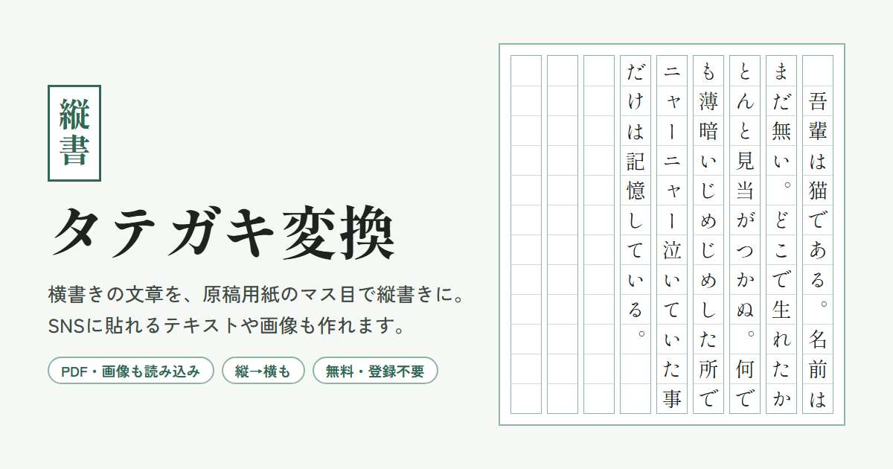

# タテガキ変換

横書きの文章を、原稿用紙のマス目で縦書きに変換する Web アプリです。SNS に貼れる縦書きテキストや画像も作れます。縦書きの文章を横書きに戻すこともできます。

無料・登録不要です。文章はブラウザの中だけで処理し、サーバーには送りません。

## できること

### 横書き → 縦書き

- **原稿用紙プレビュー**：マス目の原稿用紙に縦書きで表示し、画像（PNG）として保存できます
- **縦書きテキスト**：SNS などに貼り付けられる、文字だけの縦書きテキストを作ってコピーできます
- **1列の字数**：3〜80字で指定できます（10・15・20・40字はボタンで選べます）
- **禁則処理**：ぶら下げ（原稿用紙式）・追い出し・しない から選べます
- **列の間隔**（テキスト出力）：詰める・半角スペース・全角スペース
- **そのほかのオプション**
  - 段落の頭を1字下げる
  - 縦中横（2桁の半角数字や `!?` を1マスに横並び）
  - ルビ（`｜漢字《かんじ》` または `漢字《かんじ》` と書きます）
  - 縦書き用の記号に置き換える（`ー` → `｜`、`「` → `﹁`、`。` → `︒` など）
  - 半角英数を全角にする
  - 数字を漢数字にする（`2026` → `二〇二六`）

### 縦書き → 横書き

- 縦書きのテキストを横書きに戻します
- 字数いっぱいで折り返した列を1つの段落につなげます
- 縦書き用の記号を元に戻します
- 全角英数を半角にできます

### ファイルの読み込み

ボタンで開くか、画面にドロップして読み込めます。

| 種類 | 形式 |
| --- | --- |
| テキスト | `.txt` `.text` `.md` `.csv` |
| Word | `.docx` `.doc`（RTF 形式の `.doc` は非対応） |
| PDF | `.pdf` |
| 画像 | `.png` `.jpg` `.jpeg` `.webp` `.bmp` `.gif`（文字を読み取ります。横書き・縦書きを選べます） |

## 使い方

`index.html` をブラウザで開くだけで使えます。ビルドやインストールは要りません。

## 構成

アプリは `index.html` 1ファイルで、HTML・CSS・JavaScript をすべて含みます。

| ファイル | 内容 |
| --- | --- |
| `index.html` | アプリ本体 |
| `ogp.png` | SNS で共有したときに表示する画像（1200×630） |

使っている外部ライブラリは、必要になったときだけ CDN（jsDelivr）から読み込みます。

- [PDF.js](https://mozilla.github.io/pdf.js/)（pdfjs-dist 3.11.174）：PDF の読み込み
- [Tesseract.js](https://tesseract.projectnaptha.com/)（5.1.1）：画像からの文字の読み取り

フォントは Google Fonts の Shippori Mincho と Zen Kaku Gothic New を使っています。
